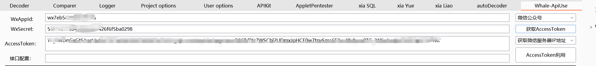
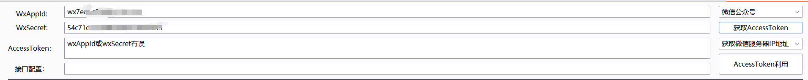

# Whale-ApiUse

## 说明

Whale-ApiUse是burp插件，可以用来测试wx公众号，微信小程序，钉钉，企业微信等的接口，通过输入key和secret进行测试，之所以做这个首先这是一个练手项目，后续也会继续维护更新，如果有好的建议欢迎留言。其次由于现有的工具都要额外下载，用起来繁琐，所以我想着通过一个插的形式进行开发，方便使用。

## 使用说明

目前钉钉的功能还不能使用，后续会补充上去。

使用，选择相对应的应用，然后输出key和secret，点击获取accesstoken。

如果key和secret有无则报错。

然后获取到的accesstoken可以直接选择后续的模块进行利用，本插件是直接获取输出框的值然后进行访问的。

## 后续开发

目前是1.0，但是其实还有一些没完成，后续开发首先要补全当前的功能，然后再补充其他应用的key和secret的使用。